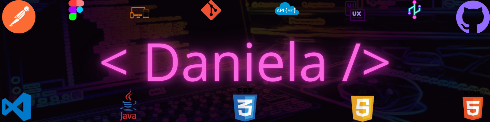

# Desarrolladora Full Stack apasionada por crear soluciones web innovadoras y creativas. 👩💻

## 📚 Sobre mí
¡Hola! Soy Dani, desarrolladora web en formación apasionada por el frontend y la experiencia de usuario. Actualmente estoy trabajando en una pagina web para un e-commerce de productos didácticos para niños con autismo, además de proyectos personales con HTML, CSS, JavaScript y Java.

## 📬 Contacto

 

## 🌟 Proyectos Destacados 🌟

<h2 style="text-align:center;" align="center">Journey - Ecommerce🐋</h2> 

Es una tienda en línea de productos didácticos diseñados especialmente para niños con autismo. Cuenta con una estética amigable en tonalidades azules, secciones claras como home, productos, contacto, sobre nosotros y login. Combina accesibilidad, funcionalidad y un propósito educativo y social.

🤝 Colaboradores
<table align="center">
<tr>

<td align="center">
<a href="https://github.com/httpsmarioooo">
 

<b>Carlos Torres</b>

</a>
</td>

<td align="center">
<a href="https://github.com/CodingtheMJ">
 

<b>MJ Gonzalez</b>

</a>
</td>

<td align="center">
<a href="https://github.com/gabriel-pinilla-c">
 

<b>Gabriel Pinilla</b>

</a>
</td>

<td align="center">
<a href="https://github.com/Tatiana-Casas">
 

<b>Tatiana Casas</b>

</a>
</td>

</tr>
</table>

<h2 style="text-align:center;">**Abecedario - Juego interactivo**🔠</h2>

Es una aplicación web interactiva para niños, donde cada letra del abecedario está representada como una card con imagen. Al tocar una card, esta cambia de color aleatoriamente. Incluye botón de reinicio y diseño responsive. Ideal para aprender jugando.

 | [Repositorio](https://github.com/DanielleSaint/LaboratorioGrupalHTML-CSS-JS)
🤝 Colaboradores
<table>
<tr>

<td align="center">
<a href="https://github.com/moniGitliz">
 

<b>Monica Calvo</b>

</a>
</td>

<td align="center">
<a href="https://github.com/JuanMendivelsoZuleta">
 

<b>Juan Mendivelso</b>

</a>
</td>

<td align="center">
<a href="https://github.com/VicR11">
 

<b>Ana Reyes</b>

</a>
</td>

</tr>
</table>

<h2 style="text-align:center;">**My list To-Do**🟣</h2>

Esta página permite agregar, eliminar y marcar como completadas tus tareas o notas diarias de manera sencilla. Todas las acciones se guardan automáticamente en el navegador mediante localStorage, asegurando que tu lista se conserve aunque cierres la página. Organiza tus pendientes y mantén el control de tus actividades fácilmente.

 | [Repositorio](https://github.com/DanielleSaint/LabEvents-part2)

## 🛠 Tecnologías y Herramientas AI

## 😎 Habilidades y Mentalidades de comportamiento

